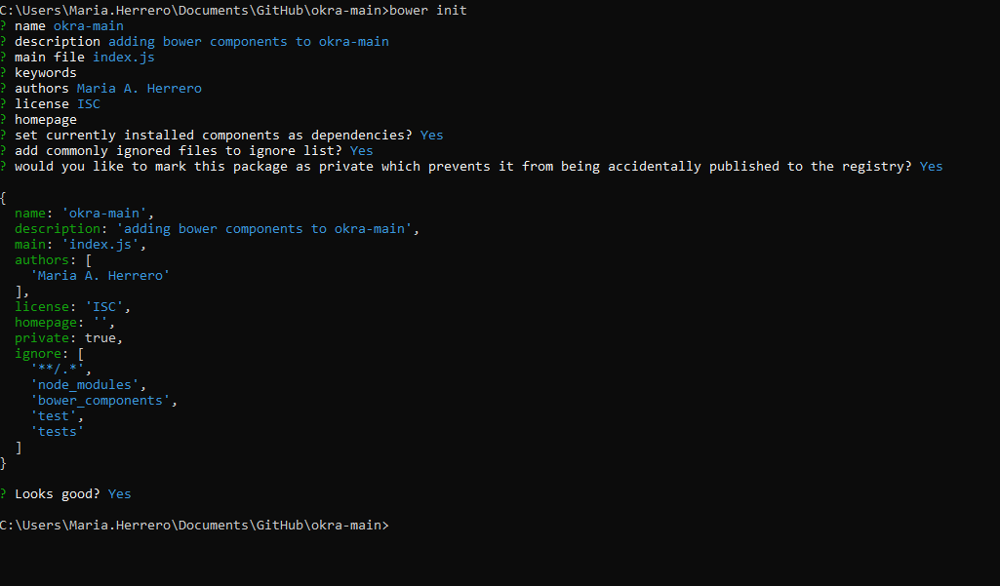

# Welcome to Okra repository

## Overview

Okra is a web application created with two aims: One is serving its users as a tool to analyse their daily consumptions and
their impact in the global, regional and local markets in an enjoyable way. The second is encourage and promote small local eco businesses to reduce 
the demand of external products. 

This application is not aiming to be a boycott to the global market. Just tries to be educational, informative, and overall a collaboration site in order 
to find a balance, responsible and healthy way of consuming natural resources.

## Development tools
  
  * Git Repository as source control manager.
        - To install Git download here [Git download.](https://git-scm.com/downloads) Choose executable depending of the platoform you are working in.
  * IDE as text editor and development framework: either Sublime Text 3 or/and Visual Studio Code. 
        - To install Sublime Text download here [Sublime Text donwload.](https://www.sublimetext.com/3) Choose executable depending of the platoform you are working in.
        - To install Visual Studio Code here [Visual Studio Code download.](https://code.visualstudio.com/download) Choose executable depending of the platoform you are working in.
  
## Okra - main framework and libraries 
  * npm
        To be able to install other third party tools and managing web packages and dependencies we need to install node.js and the npm command line interface.
        To install node.js and npm command line interface using node installer go here [Node.js download.](https://nodejs.org/en/download/).Choose executable depending of the platform you are working in.
        Otherwise, and a better option, is using Node Version Manager nvm. You can find more information [here.](https://docs.npmjs.com/downloading-and-installing-node-js-and-npm)
        You might need to restart the computer to make effective the installation. Check node version installed typing node --version. Check npm version typing npm --version.
        In case npm is not accesible from your path, type: npm install npm -g, this will make accesible the command line from all the projects you create.
        
  * adding bower, bootstrap and angular to web package
        
    Installing bower globally in computer using npm: npm install -g bower

    Initialize bower in web project: bower init

    

    To add bootstrap libraries go to the project directory and type: bower install bootstrap --save

    Now that bootstrap is installed do the same with angular: bower install angular --save

    And again for angular router: bower install angular-route --save

  * http-server (set up lightweight server to run application in a development environment)
    To install globally a development server in the machine npm install -g http-server
   

  * js sequence-diagram / Plant uml(require java runtime j2re)
    

## Okra - main setup and configuration (Development environment)

  Initialize npm package with main project information. Go to terminal, locate in project directory and type npm init

  
    

## Okra - main deploy and run (Development environment)

 To run web project in development server locate in project directory and type http-server -c-1

## Okra - main (Production environment)

## Link to Analysis and Design documentation [Project document](doc/OkraDoc_v.1.0.md)