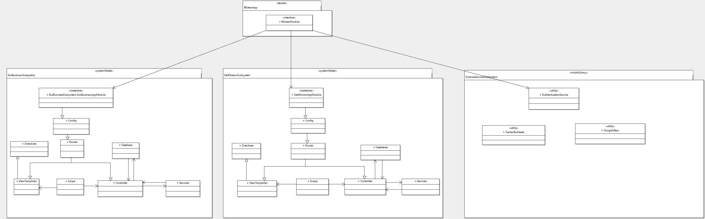
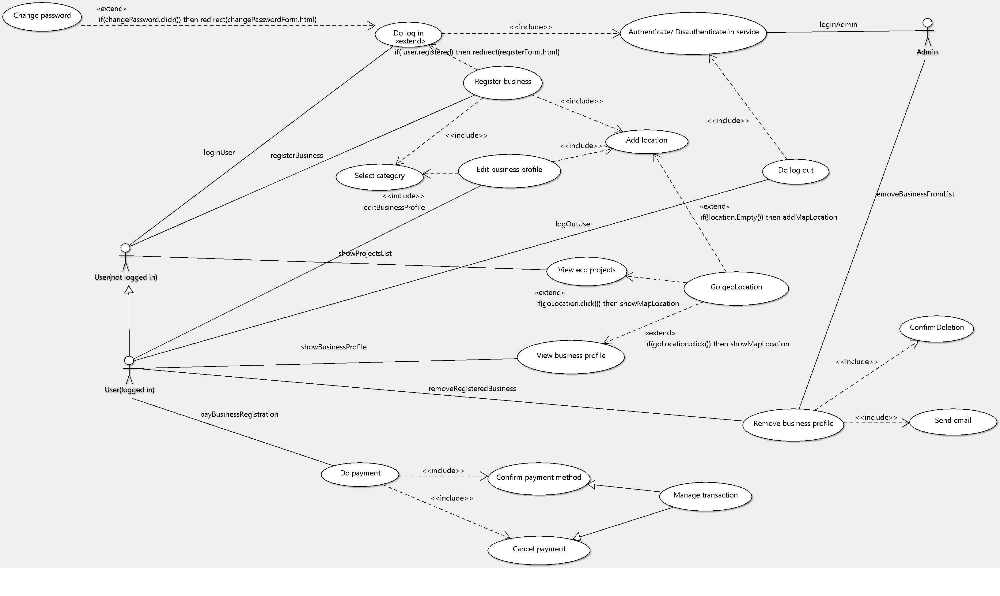
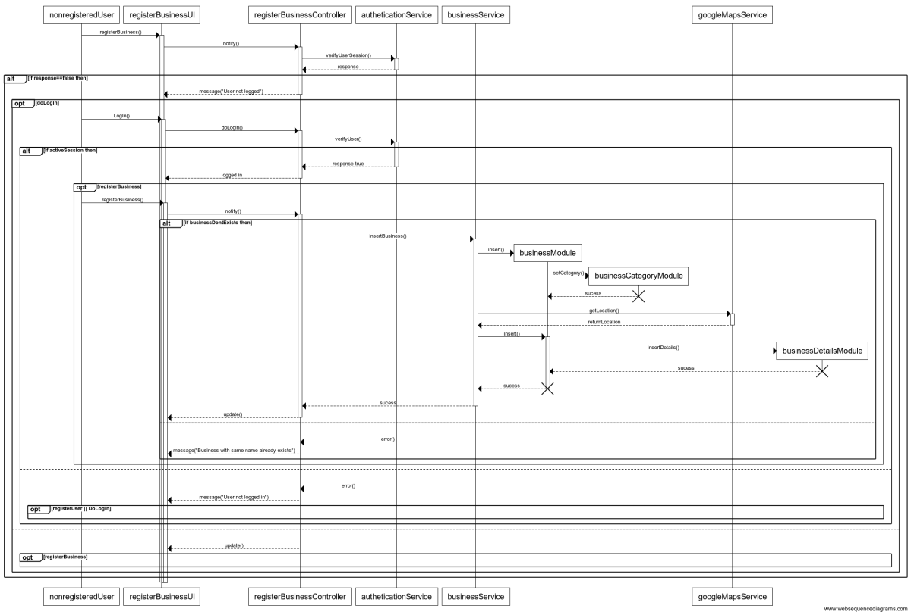
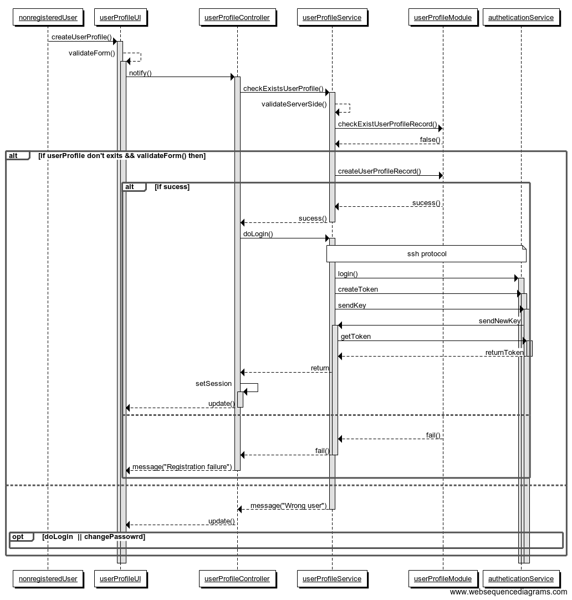
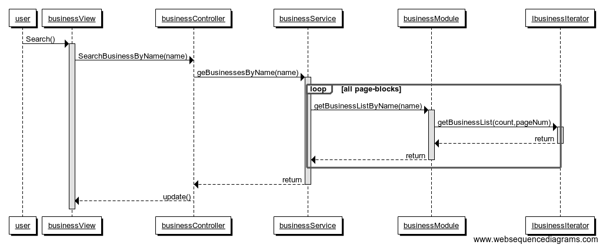
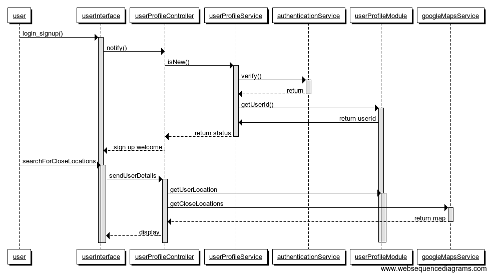

# Okra

# UX Desing
```
1. Strategy
  1. Business Goals:
     . Create a collaboration site for a responsible consumption of products. 
     . Serving as a tool to analyse population consumptions.
     . Promote local green/eco-businesses.
     . Promote a change in lifestyles.
     . Inform about nocive products on the market and diseases derived of irresponsible consumptions.
     . Be funny. People needs feeling happy and convinced for a change.
     . Give trusted and verified information.
  2. User Constituencies:
     . Age 16 to death.
     . Future (sell to schools too.)
  3. Usage Context:
     . Everywhere during free time (desktop, laptop, tablet, mobile). Corss-platform web application.
     . People's conversations.
     . rss feeds from twitter API(consuming twitter API, filter comments with keywords from lobbies and display them)
  4. Promotion
     . Signficative payment to register and announce a new business (subscription-based payments) 
     . Twitter
     . Google Adworks
     . Sustainable events
     . Through bankpayments registered user can get discounts (shopping-cart checkout) when buying in organic "eco" business
```

# Project Folder Estructure
```
.Okra
   |-okra-main (angular framework - javascript - jazmine test- bower - bootstrap - http-server) - Stream 1
       |-modules
           |-login.module.js
           |-registeruser.module.js
       |-controllers
       |-filters
       |-directives
       |-services
         |-authenticationservice
       |-partials
   |-okra-mission-subsystem (flask framework - python - mongodb) 
       |-EatingModule (Integration with fatSecret to generate a healthy diet + CRUD with mongoDb) - Module 7 and Module 8
            |-api
            |-data
            |-static
               |-bower-components
            |-templates
               |-base.html
               |-fooddiary.html
               |-mision.html
               |-missionstart.html
       |-FashionModule
       |-HobbiesModule
   |-ecobusiness-subsystem (django - sqllite - bootstrap)
      |-RegisterEcobusiness
         |-paymentModule using Stripe (subscription-based payment)
         |-registerBusinesses
         |-login
   |-external-services-subsystem
       |-TwitterRssFeeds
       |-GoogleMaps
       |-FatSecret
```

# Balsamiq Mockups

[Download balsamiq project here](balsamiq/)

*BGreen packages diagram*


*BGreen use case diagram*


*Register new business sequence diagram*


*Register new user sequence diagram*


*Edit projects list sequence diagram*


*Select businesses with close locations*


# Use Case Diagrams

# Jazmine Unit Test